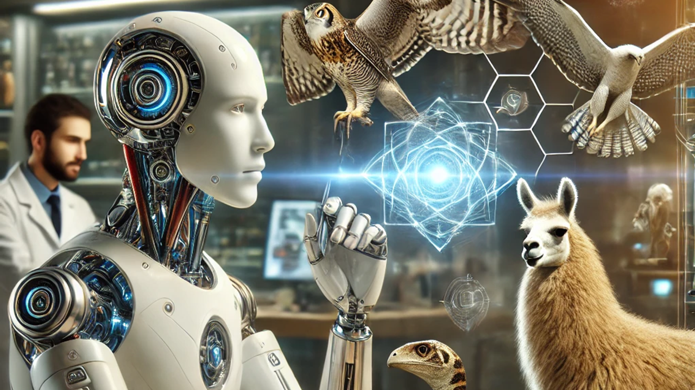

# [**Hands-on Generative AI Engineering with Large Language Models**](https://www.udemy.com/course/hands-on-generative-ai-engineering-with-large-language-model/?referralCode=0775DF5DDD432646AD97)

Welcome to [my course on Udemy](https://www.udemy.com/course/hands-on-generative-ai-engineering-with-large-language-model/?referralCode=0775DF5DDD432646AD97)!

Dive into the rapidly evolving world of Generative AI with our comprehensive course, designed for learners eager to build, train, and deploy Large Language Models (LLMs) from scratch.

This course equips you with a wide range of tools, frameworks, and techniques to create your GenAI applications using Large Language Models, including Python, PyTorch, LangChain, LlamaIndex, Hugging Face, FAISS, Chroma, Tavily, Streamlit, Gradio, FastAPI, Docker, and more.

This hands-on course covers essential topics such as implementing Transformers, fine-tuning models, prompt engineering, vector embeddings, vector stores, and creating cutting-edge AI applications like AI Assistants, Chatbots, Retrieval-Augmented Generation (RAG) systems, autonomous agents, and deploying your GenAI applications from scratch using REST APIs and Docker containerization.

By the end of this course, you will have the practical skills and theoretical knowledge needed to engineer and deploy your own LLM-based applications.

## Course Introduction Video
[Intro_video](https://www.youtube.com/watch?v=_699r2LVzFo)

## Table of content
- Introduction to the Course
    - Course Objectives
    - Course Structure
    - Learning Paths
- Part 1: Software Prerequisites for Python Projects
    - IDE
        - VS Code
        - PyCharm
    - Terminal
        - Windows: PowerShell, etc.
        - macOS: iTerm2, etc.
        - Linux: Bash, etc.
    - Python Installation
        - Python installer
        - Anaconda distribution
    - Python Environment
        - venv
        - conda
    - Python Package Installation
        - PyPI, pip
        - Anaconda, conda
    - Software Used in This Course
- Part 2: Introduction to Transformers
    -	Introduction to NLP Before and After the Transformer’s Arrival
    -	Mastering Transformers Block by Block
    -	Transformer Training Process
    -	Transformer Inference Process
- Part 3: Implementing Transformers from Scratch with PyTorch
    -	Introduction to the Training Process Implementation
    -	Implementing a Transformer as a Python Package
    -	Calling the Training and Inference Processes
    -	Experimenting with Notebooks
- Part 4: Generative AI with the Hugging Face Ecosystem
    -	Introduction to Hugging Face
    -	Hugging Face Hubs
        -	Models
        -	Datasets
        -	Spaces
    -	Hugging Face Libraries
        -	Transformers
        -	Datasets
        -	Evaluate, etc.
    -	Practical Guides with Hugging Face
        -	Fine-Tuning a Pre-trained Language Model with Hugging Face
        -	End-to-End Fine-Tuning Example
        -	Sharing Your Model
- Part 5: Components to Build LLM-Based Web Applications
    -	Backend Components
    -	LLM Orchestration Frameworks: LangChain, LlamaIndex
    -	Open-Source vs. Proprietary LLMs
    -	Vector Embedding
    -	Vector Database
    -	Prompt Engineering
    -	Frontend Components
    -	Python-Based Frontend Frameworks: Streamlit, Gradio
- Part 6: Building LLM-Based Web Applications
    -	Task-Specific AI Assistants
        -	Culinary AI Assistant
        -	Marketing AI Assistant
        -	Customer AI Assistant
        -	SQL-Querying AI Assistant
        -	Travel AI Assistant
        -	Summarization AI Assistant
        -	Interview AI Assistant
    -	Simple AI Chatbot
    -	RAG (Retrieval-Augmented Generation) Based AI Chatbot
        -	Chat with PDF, DOCX, CSV, TXT, Webpage
    -	Agent-Based AI Chatbot
        -	AI Chatbot with Math Problems
        -	AI Chatbot with Search Problems
- Part 7: Serving LLM-Based Web Applications
    -	Creating the Frontend and Backend as Two Separate Services
    -	Communicating Between Frontend and Backend Using a REST API
    -	Serving the Application with Docker
    -	Install, Run, and Enable Communication Between Frontend and  Backend in a Single Docker Container
    -	Use Case
    -	An LLM-Based Song Recommendation App
- Conclusions and Next Steps
    -	What We Have Learned
    -	Next Steps
- Thank You

